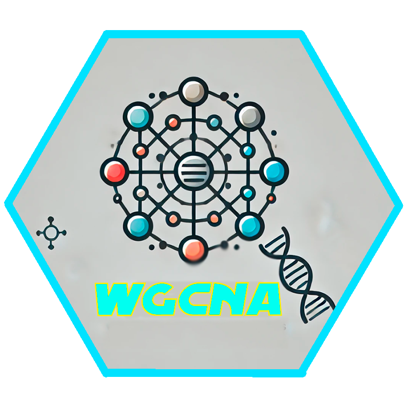

# WGCNA

## 📝 Descripció  

Aquesta és una aplicació web interactiva desenvolupada en **Shiny** per realitzar **Anàlisi de Xarxes de Co-Expressió Gènica Ponderada** (*Weighted Gene Co-Expression Network Analysis*, **WGCNA**).  

## 🚀 Característiques  

✅ **Carregar** dades d'expressió gènica  

✅ **Construir** xarxes de co-expressió gènica  

✅ **Explorar** mòduls de gens correlacionats  

✅ **Visualitzar** resultats de manera interactiva  

✅ Anàlisi d'agrupament jeràrquic basat en similitud d'expressió gènica  

✅ Identificació i visualització de mòduls de gens amb gràfics dinàmics  

✅ Exportació de resultats en múltiples formats  